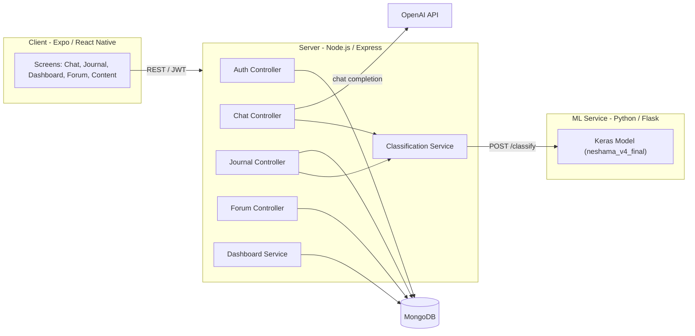

# Neshama
# Demo https://drive.google.com/file/d/1TIcrXsW1LiJcLSjotCwAMW-PULDnBzdI/view
**Your safe space for inner peace.**

Neshama is a mental wellness companion app that pairs a compassionate AI chat experience with journaling, guided calming content, and community support — helping people reflect, grow, and find inner peace, in both English and Hebrew.

> Neshama is dedicated to supporting your emotional wellbeing through thoughtful technology. We believe everyone deserves a safe, private space to reflect, grow, and find inner peace.

## Important Disclaimer

Neshama is **not** a substitute for professional medical or mental health care. It is a supportive tool, not a diagnostic or crisis service. If you or someone you know is in crisis, please contact a licensed mental health professional or local emergency services immediately.

## Features

- **AI Chat Companion** — a compassionate AI companion, powered by OpenAI, available whenever you need someone to talk to.
- **Journaling & Mood Tracking** — track your thoughts, feelings, and emotional patterns over time.
- **Emotion Classification** — journal entries and chat messages are analyzed by a custom-trained TensorFlow/Keras model that detects `normal`, `anxiety`, or `depression` signals with a confidence score, surfaced back to the user through the dashboard.
- **Calming Content Library** — guided meditation, breathing exercises, yoga sessions, and relaxation audio.
- **Community & Support** — connect with others in a safe, moderated forum, with crisis resources available.
- **Personal Dashboard** — wellness analytics that visualize mood and emotional trends over time.
- **Multi-language & RTL** — full English and Hebrew localization with right-to-left layout support.
- **Secure Accounts** — JWT-based authentication with registration, login, and profile management.

## Architecture

Neshama is a monorepo with three main parts: a cross-platform mobile client, a Node.js API server, and a Python ML microservice for text classification.



- The **client** calls the **server**'s REST API for auth, chat, journaling, forum, content, and dashboard data.
- The **server** calls **OpenAI** to power AI chat responses.
- The **server** sends journal/chat text to the **ML service**, which runs it through a Keras text classifier (translating Hebrew to English first, since the model was trained on English text) and returns a `normal` / `anxiety` / `depression` label with probabilities.
- All persistent data (users, journal entries, forum posts, content) is stored in **MongoDB**.

## Tech Stack

### Client (`client/`)
- [Expo](https://expo.dev/) / React Native, TypeScript
- Redux Toolkit + React Redux for state management
- React Navigation (native stack + bottom tabs)
- NativeWind / Tailwind CSS for styling
- Formik + Yup for forms and validation
- Custom i18n layer with English/Hebrew translations and RTL support
- Jest + React Native Testing Library for tests

### Server (`server/`)
- Node.js + Express 5
- MongoDB with Mongoose
- JWT authentication (`jsonwebtoken`, `bcryptjs`)
- OpenAI SDK for AI chat
- Jest + Supertest + `mongodb-memory-server` for tests

### ML Service (`server/ml-service/`)
- Python + Flask
- TensorFlow / Keras text classification model (`neshama_v4_final.keras`)
- Tokenizer-based preprocessing with a fixed sequence length

## Repository Structure

```
Neshama-Final-main/
├── client/                    # Expo / React Native mobile app
│   └── app/
│       ├── screens/           # Chat, Journal, Dashboard, Forum, Content, Auth, etc.
│       ├── components/        # Shared UI components
│       ├── navigation/        # Stack & tab navigators
│       ├── store/             # Redux store & slices
│       ├── services/          # API client services
│       ├── i18n/              # English/Hebrew translations, RTL support
│       └── theme/             # Colors, typography, spacing
├── server/                    # Node.js/Express API
│   ├── src/
│   │   ├── config/            # Env config & DB connection
│   │   ├── controllers/       # Auth, chat, journal, forum, content, dashboard
│   │   ├── middleware/        # JWT auth middleware
│   │   ├── models/            # Mongoose models
│   │   ├── routes/            # Express routes
│   │   ├── services/          # Classification, dashboard, translation services
│   │   └── index.js           # Entry point
│   ├── ml-service/            # Python Flask ML microservice
│   │   ├── app.py             # Classification API (/classify, /health, /warmup)
│   │   └── requirements.txt
│   ├── Dockerfile             # API container
│   ├── Dockerfile.ml          # ML service container
│   └── README.md              # Detailed API documentation
├── docker-compose.yml         # Orchestrates api + ml-service containers
└── .github/workflows/         # CI/automation (e.g. keep-render-awake)
```

## Getting Started

### Prerequisites

- [Node.js](https://nodejs.org/) v18+ (v22 recommended)
- [Python](https://www.python.org/) 3.9+ for the ML service
- MongoDB (local instance or [MongoDB Atlas](https://www.mongodb.com/atlas))
- [Expo CLI](https://docs.expo.dev/get-started/installation/) (installed automatically via `npx`)
- An OpenAI API key
- Docker & Docker Compose (optional, for containerized setup)

### 1. Clone the repository

```bash
git clone https://github.com/ShoamBenDavid/neshama-app.git
cd neshama-app
```

### 2. Run the ML service

```bash
cd server/ml-service
pip install -r requirements.txt
python app.py
```

The ML service starts on `http://localhost:5001` and exposes `/classify`, `/health`, and `/warmup`.

### 3. Run the API server

Create a `.env` file in `server/` (see `server/src/config/config.js` for the full list of variables):

```bash
MONGODB_URI=your-mongodb-connection-string
JWT_SECRET=your-jwt-secret
JWT_EXPIRE=7d
OPENAI_API_KEY=your-openai-api-key
ML_SERVICE_URL=http://localhost:5001
PORT=5000
```

Then install and run:

```bash
cd server
npm install
npm run dev
```

See [server/README.md](server/README.md) for full API endpoint documentation.

### 4. Run the client app

```bash
cd client
npm install
npm start
```

Then use the Expo CLI menu to launch on iOS, Android, or the web.

### Option: Docker Compose

To run the API and ML service together in containers:

```bash
docker-compose up --build
```

This builds and starts the `api` (port `5000`) and `ml-service` (port `5001`) containers, using the same environment variables as above (set them in your shell or an `.env` file alongside `docker-compose.yml`).

## Testing

```bash
# Server tests
cd server
npm test

# Client tests
cd client
npm test
```

## Localization

The client ships with full English and Hebrew translations (`client/app/i18n/translations/`) and automatically applies right-to-left layout when Hebrew is selected.
